# calc

**a customizable windows 10/11 calculator clone for trinity desktop (TDE)**

`calc` is a highly configurable, modern, and lightweight scientific calculator designed specifically for the Trinity Desktop Environment (TDE). 

Initially conceived as a simple visual clone of the Windows 10/11 calculator built using C++ and TQt3, `calc` has evolved into a feature-rich, deeply customizable desktop calculator. It faithfully replicates all the mathematical functions, layout logic, history workflows, and behavior of the native Windows calculator, while allowing users to customize its theme, layout structure, fonts, and language behavior.

---

## Features

- **Faithful Windows 10/11 Replication**: Pixel-perfect look-and-feel of the Windows calculator UI, matching standard buttons, converters, memory keys, and calculation stack logic.
- **Multiple Layout Modes**: Standard, Scientific, Programmer (with binary/octal/decimal/hex bases, bitwise operations, and bit toggles), Date Calculation, and Statistics.
- **Unit Conversions**: Built-in support for converting units of Volume, Length, Weight/Mass, Temperature, Energy, Area, and Speed.
- **Interactive History Window**: Visual list of past expressions and results, allowing users to recall expressions or clear history, built with scalable UI coordinates.
- **Highly Configurable Look**: Change fonts (Default, System, Custom, LCD fonts), icons (Default, Inverted, Color), layout borders, and themes (Classic, Classic Dark, Custom).
- **Trinity Philosophy Integration**: Extremely fast startup times and low resource usage, keeping in harmony with TDE's lightweight philosophy.

---

## Architectural Highlights

- **GMP-Powered Arithmetic**: Utilizes the GNU Multiple Precision Arithmetic Library (`gmp`) via a custom `KNumber` backend to achieve arbitrary-precision calculation of floats, integers, and fractions.
- **Binary-Splitting Factorial**: Integers are computed using GMP's native `mpz_fac_ui()` implementation, delivering highly optimized performance for large factorials.
- **Static Initialization Safeguards**: All core mathematical and conversion constants use the C++ *construct-on-first-use* idiom to avoid static initialization order fiascos and prevent startup segmentation faults.
- **Clean Error Boundaries**: Replaces side-effect-prone statistical helpers with clean getters (`hasError()`) and reset hooks (`clearError()`) to ensure reliable calculation states.

---

## Embedded & Compressed Resource Pipeline

To ensure the fastest possible startup times, `calc` operates without reading external translation or image files from disk during runtime:
- **Compressed Assets**: Icons, fonts, and translations are compiled into the binary as compressed raw bytes.
- **On-the-fly Decompression**: At runtime, these assets are decompressed in memory in a fraction of a millisecond.
- **Dual-Compression Pipeline**:
  - **ZX0 (Release)**: An optimal compressor that achieves extremely high compression ratios. While compression is computationally expensive and slow, it yields excellent ratios and offers ultra-fast decompression (much faster than LZMA and comparable to Zlib/LZ4), with a footprint of only 60 lines of C code and no dynamic allocation.
  - **LZ4 (Development)**: An ultra-fast compression algorithm used in development builds to guarantee near-instantaneous asset packing times.
- **Dynamic Translation System**: Instead of parsing external `.qm` or `.mo` locale catalog files, `calc` ships with a dynamic `TQMap`-based string mapping lookup parsed from the packed text resource, automatically resolving translations (French, German, Spanish, Russian, Hindi, and English) at runtime based on the user's active locale.

### zx0em Pre-Decoded Pixel Pipeline (libpng Bypass)

To eliminate visual startup lag caused by sequentially decoding 30+ icons, `calc` integrates a raw pixel resource pipeline (`zx0em` format):
- **Instant Startup Speed (0 ms)**: Sequentially decoding more than 30 PNG icons via `libpng` requires parsing headers, executing the Deflate decompression algorithm, assembling IDAT chunks, reversing PNG spatial filters, and expanding pixel channels. By adopting the pre-decoded raw format of `zx0em`, pixel access becomes instantaneous (via direct memory reading or simple memory copies), which completely eliminates any visible startup lag.
- **Minimal Binary Size Impact (+4 KB)**: Thanks to the high compression ratio of ZX0 and the automated font table stripping (`ttf_strip.c`), the total binary size on disk only increases by approximately 4 KB compared to the original PNG-based asset implementation.
- **Negligible Memory Footprint**: The additional RAM overhead of ~450 KB (required for holding decompressed raw pixels in memory) is completely unnoticeable compared to the ~20 MB average baseline RAM usage of KCalc, and is easily justified by the fluid startup experience.
- **Independence & Stability**: By bypassing `libpng` entirely for embedded resources, the program is no longer subject to formatting warning logs or system library API changes during in-memory decoding.

### Comparison & Architectural Rationale

From an end-user's perspective, the practical gains of switching from Zlib to ZX0 are virtually unnoticeable:
- **Disk Footprint**: The final binary size is exactly identical (**640 KB** on disk) due to ELF segment page alignment constraints on Linux (we are bound by the hardware-enforced 4 KB page boundaries).
- **Startup Speed**: Decompressing ~200 KB of assets takes less than 0.5 milliseconds in all cases. The difference is imperceptible.
- **RAM Footprint**: Although the direct linkage to `libz` has been removed, the shared library `libz.so` is still loaded into memory by other system dependencies (such as `libpng` or `libfreetype`). Therefore, there is no overall reduction in the system's memory footprint.

However, from a development and maintenance standpoint, this transition is a **net positive**:
- **Zero External Dependency**: Removing the requirement for `zlib1g-dev` on the host side simplifies compilation and setup, making the project more portable and self-contained.
- **Code Robustness & Security**: The embedded ZX0 decompressor is a minimal 60-line C function with no dynamic memory allocation (`malloc`), no complex pointer tables, and no dynamic state variables. Compared to the thousands of lines of code in Zlib, it is extremely easy to audit and completely immune to the common memory-related security issues found in complex decompression libraries.
- **Clean Dev vs Release Pipeline**: Integrating LZ4 for development builds enables near-instant asset compiling, while using ZX0 for release builds ensures the tightest possible asset packaging without runtime overhead.

While the initial goal was to reduce the file size on disk below 640 KB, segment alignment padding under Linux prevented this (due to the 4 KB page granularity). Nevertheless, I kept this implementation because transitioning to ZX0 represents a positive architectural improvement: the binary is cleaner, more self-contained, freed from a development package dependency, and relies on a minimalist decompressor perfectly suited for embedded or freestanding-like software architectures.

---

## Dependencies

To compile `calc`, you need standard developer tools and the Trinity Desktop SDK:

### Build System
- `cmake` (>= 3.0)
- `clang++` (or `g++` with C++17 support)
- Python 3 (for compiling the static asset pipeline during the build)

### Libraries & Headers
- **TQt3 / TDE SDK**: `tqt3-dev`, `tdelibs14-trinity-dev` (providing `tdecore` and `tdeui`)
- **GMP**: `libgmp-dev` (arbitrary-precision math)
- **Fontconfig**: `libfontconfig1-dev` (custom fonts registration)
- **X11**: `libx11-dev` (windowing systems)

---

## Compilation

You can compile `calc` by using the helper script `build.sh` provided in the root directory:

### Automatized Build
To compile the final release binary using maximum ZX0 compression (default):
```bash
./build.sh
```

To compile a development build using fast LZ4 compression (which speeds up python asset compilation):
```bash
./build.sh dev
```
This script will configure CMake using Clang, trigger the Python asset generation pipeline, clean up previous builds, and compile the final optimized executable in the `build/` directory.

### Cleaning Build Files
To clean all temporary build files and intermediate targets:
```bash
./build.sh clean
```

### Manual Build
If you prefer to compile manually:
```bash
mkdir -p build
cd build
# For ZX0 (Release)
cmake -DCMAKE_CXX_COMPILER=clang++ -DCMAKE_C_COMPILER=clang -DCOMPRESS=zx0 ..
# For LZ4 (Development)
cmake -DCMAKE_CXX_COMPILER=clang++ -DCMAKE_C_COMPILER=clang -DCOMPRESS=lz4 ..
make -j$(nproc)
```

---

## Screenshots

Click on any screenshot to view the full-size image.

| | | |
|:---:|:---:|:---:|
| <a href="screenshots/screenshot_calc_1.jpg">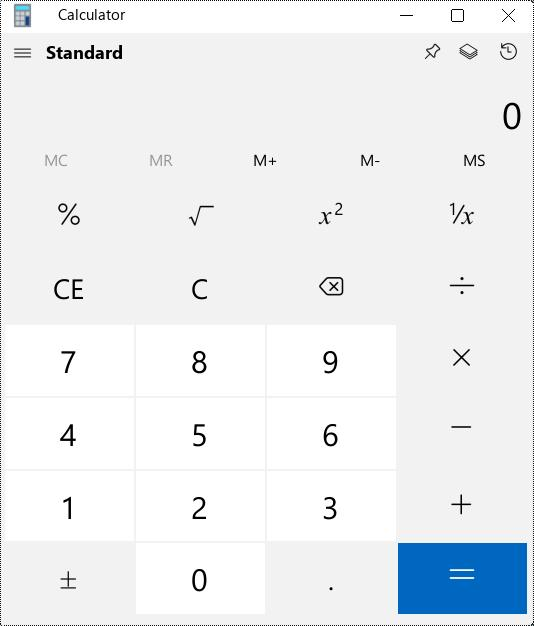</a> | <a href="screenshots/screenshot_calc_2.jpg">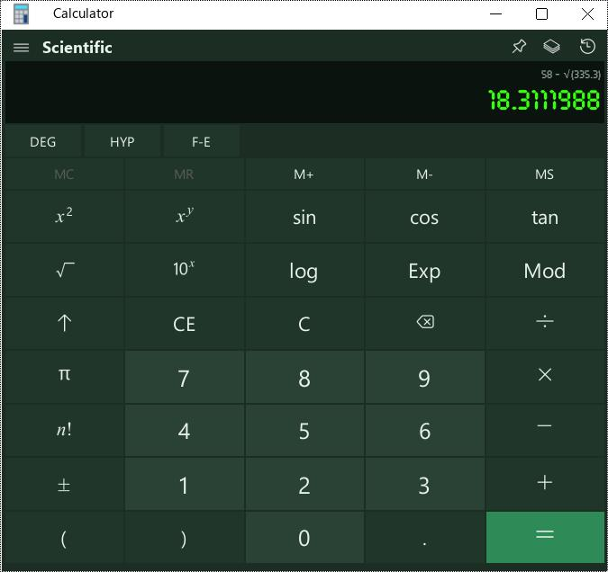</a> | <a href="screenshots/screenshot_calc_3.jpg">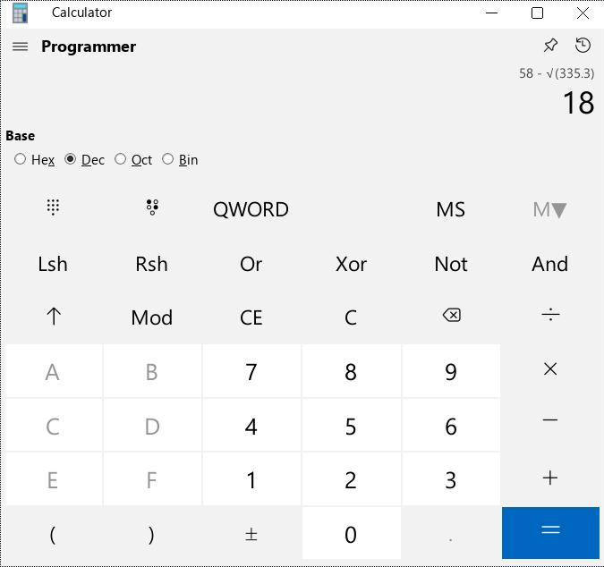</a> |
| <a href="screenshots/screenshot_calc_4.jpg">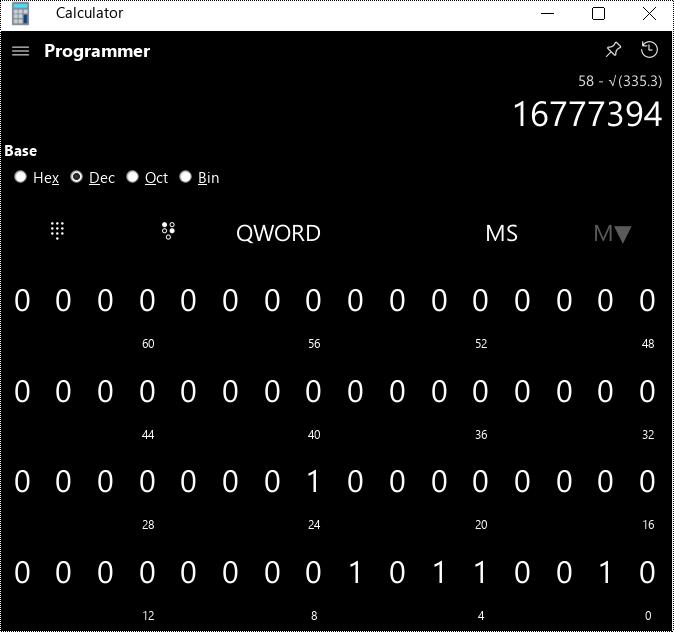</a> | <a href="screenshots/screenshot_calc_5.jpg">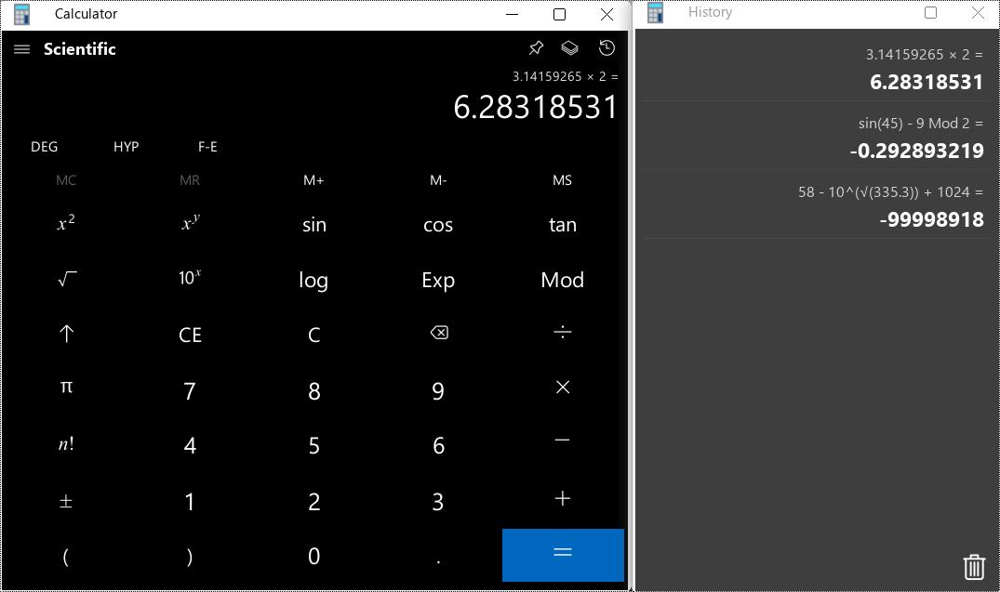</a> | <a href="screenshots/screenshot_calc_6.jpg">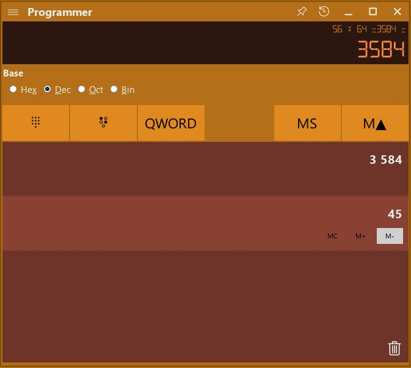</a> |
| <a href="screenshots/screenshot_calc_7.jpg">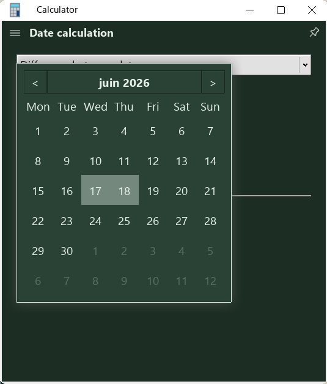</a> | <a href="screenshots/screenshot_calc_8.jpg">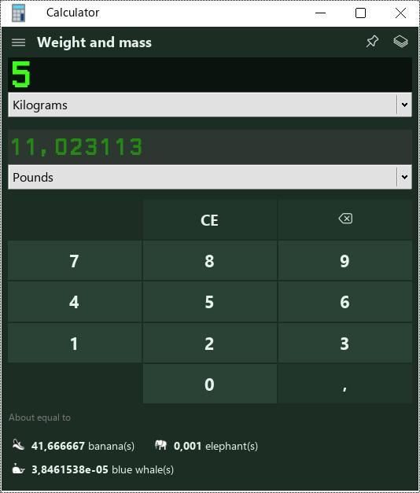</a> | <a href="screenshots/screenshot_calc_9.jpg">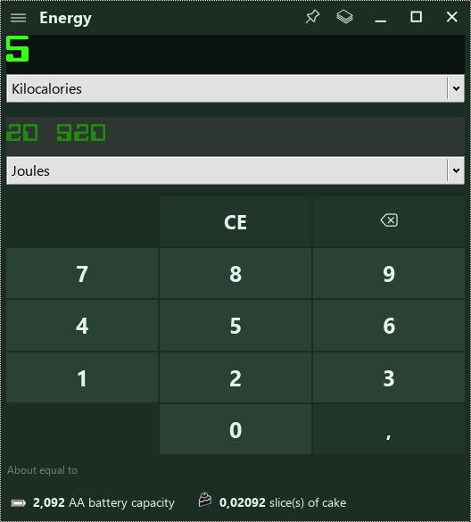</a> |
| <a href="screenshots/screenshot_calc_10.jpg">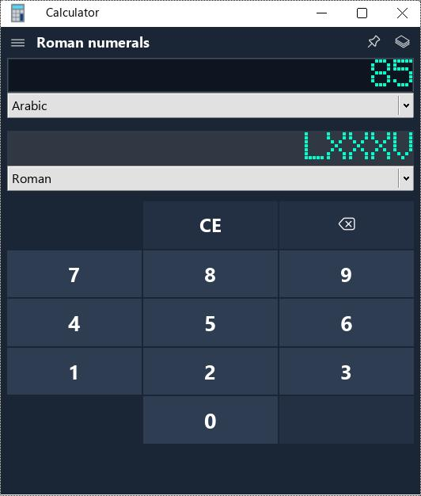</a> | <a href="screenshots/screenshot_calc_11.jpg">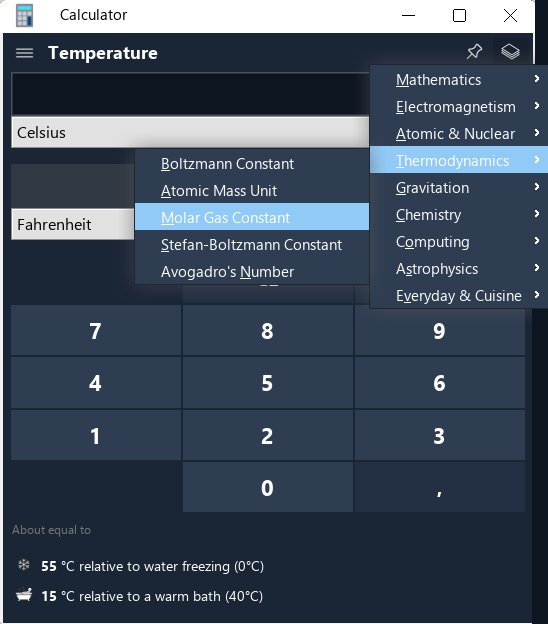</a> | <a href="screenshots/screenshot_calc_12.jpg">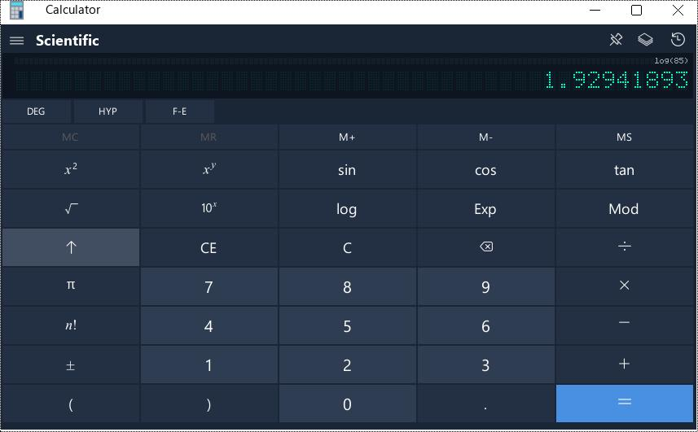</a> |
| <a href="screenshots/screenshot_calc_13.jpg">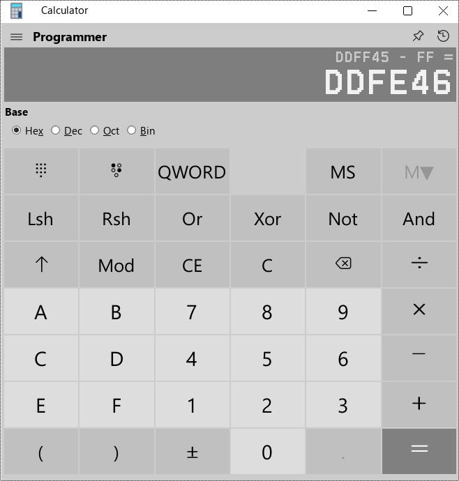</a> | <a href="screenshots/screenshot_calc_14.jpg">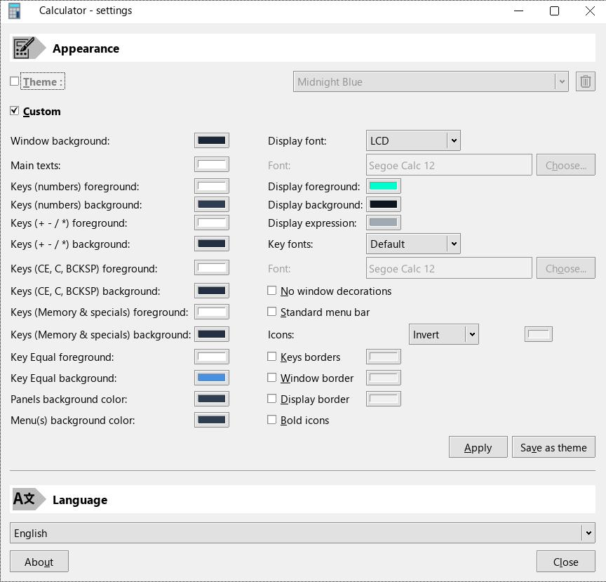</a> | <a href="screenshots/screenshot_calc_15.jpg">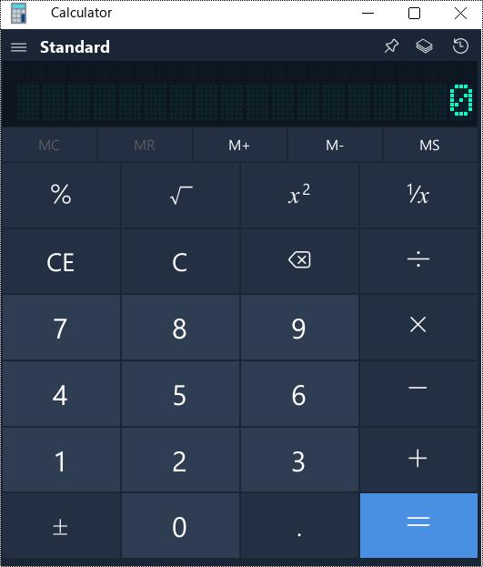</a> |
